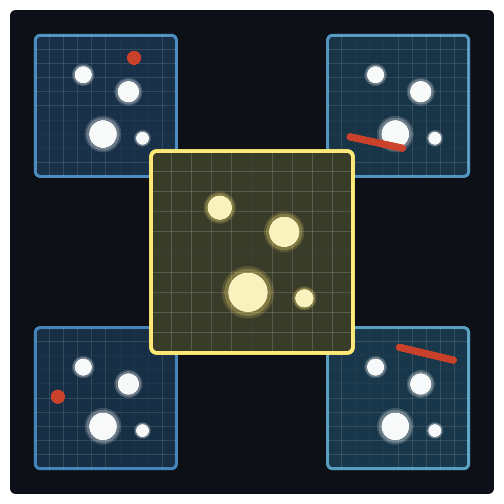

# imcombiners
**(Image + Combiner + Rust(rs))**, made for Python.

<p align="center">
  
</p>


`imcombiners` was built for astronomical image-stack combination. Generic reductions now live in the companion `reducers` package; imcombiners focuses on stack combination plus imcombine-style rejection. Pure stack reductions use `reducers` with imcombiners' finite-only policy: both `NaN` and `inf` are skipped.

Documentation: https://ysbach.github.io/imcombiners/
GitHub: https://github.com/ysBach/imcombiners

The package started as a tool for the main developer(@ysBach)'s reduction tools ([ysfitsutilpy](https://github.com/ysBach/ysfitsutilpy)). It is a result of their graduate school life, TA experience (2016-2023), and astropy image combination TF experience (2020). After years of use & trial using `numba`, I finally rewrote the core in Rust for better speed, reliability, and maintainability.

Now it targets a modern Python API around Rust kernels, with IRAF `IMCOMBINE` compatibility but with **better speed & API**.
Tests and benchmark material compare supported paths against IRAF, Astropy/NumPy, `ccdproc`, and `bottleneck` where appropriate. On a personal laptop (Apple M4 Pro), I experience a factor of few speedup over IRAF and dozens times over Python-based tools (astropy/ccdproc/bottleneck) for typical use cases. See the Documentation.


## First Look
The package has **four** usage modes:

1. Recommended: **Standard `Combiner().combine()`** approach,
2. CLI-friendly: compact `ndcombine()` wrapper,
3. Deep-inspection: **Chained `Combiner()`**, and
4. Advanced: direct kernel calls.

Start with standard `Combiner` usage for ordinary Python workflows.

```python
import numpy as np
import imcombiners as imc

rng = np.random.default_rng(20250311)
stack = rng.normal(1000, 5, (15, 256, 256)).astype("float32")

cmb = imc.Combiner(stack)
out = cmb.combine(
    "median",  # final stack-combination method
    # 1. Optional pre-rejection threshold masking
    thresholds=(0.0, 65000.0),
    # 2. Optional per-image zero/scale normalization
    zero=None,
    scale="median",
    # 3. Optional pixel rejection before final combination
    rejectors=[
        imc.MinMaxClip(n_min=1, n_max=0.1),
        imc.SigClip(sigma=3.0, maxiters=5),
    ],
    diagnostics=None,  # output-only fast path
)
```

See [docs/quarto/index.qmd](docs/quarto/index.qmd#first-look) for the detailed explanations, API-level guidance, and conventions behind this example.

## Features

- Stack combination: mean, median, lower median, percentiles, sum, min, max, variance, and weighted mean via `weight=`.
- 1-D rejection helpers: `imcombiners.kernels` exposes `_1d` functions such as `sigclip_mask_1d`, `pclip_1d`, and `minmax_combine_1d`. Use the companion `reducers` package for standalone fast reductions such as mean, median, percentile, and variance.
- Pixel rejection: sigma, CCD noise-model, iterative linear, min/max, and IRAF-style percentile clipping. Rejection centers accept mean, median, and lower median (`lmedian`/`lmed`).
- Pipeline helpers: threshold masking, zero/scale normalization, offset padding, masks, `diagnostics=None|"simple"|"full"`, and output-only fast paths.
- See documentations for details and examples.

## Install

For Python projects:

```bash
uv add imcombiners

# For development:
# You may activate your Python environment before this, e.g.,
# source ~/.venvs/your_env/bin/activate
uv pip install -e ".[dev]"
```
```

For Rust crate use:

```toml
[dependencies]
imcombiners = "0.1.1"
```


## Testing and Benchmarks

```bash
uv run pytest
uv run --extra bench python benchmarks/benchmark_combine.py
uv run python benchmarks/benchmark_threads.py
```

`--quick` runs the smoke benchmark matrix. Omit it to run the full table that
backs the published benchmark documentation.
