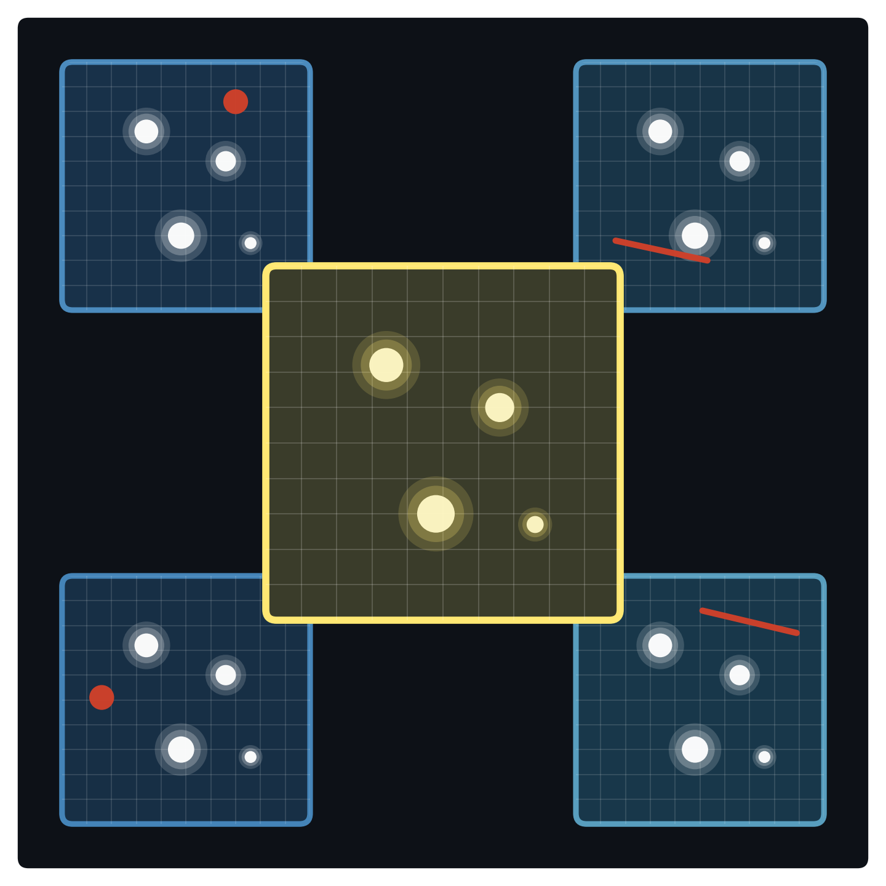

::: {.brand-header}
{fig-alt="imcombiners logo" .brand-mark}
:::

**Image + Combiner + rs (Rust) = `imcombiners` = `imc`**

Originally this package was developed with astronomical image combinations in mind, but it is designed to be general-purpose and should be useful for any stack combination and pixel rejection task.

## 0. Some Historical Notes

The skeleton of this package started in `ysfitsutilpy.imutil` around 2019-2020,
after repeated astronomy image-reduction workflows showed that existing
Astropy/`ccdproc` paths were not fast enough to replace IRAF `IMCOMBINE` in
some pipelines. Later prototypes explored `numba`, but the final implementation
uses Rust for the core kernels.

The project aims to provide a modern Python API around fast Rust kernels, with
IRAF `IMCOMBINE` compatibility where that behavior is useful for reproducible
astronomical reductions.

The package has four usage modes: **Standard Combiner**, **compact ndcombine() wrapper**, **Chained Combiner**, and **direct kernel calls**. Start with Standard Combiner for ordinary Python workflows; use direct kernel calls only when you are building a custom high-throughput layer.

The package also treats reproducibility as one of the most important targets.
Where IRAF compatibility is supported, tests compare `imc` results against
IRAF. Other comparison tests use strict assertions against Astropy/NumPy or
`ccdproc` reference outputs where appropriate.


## 1. First Look

Rust-backed Python kernels combine and reject stacks along axis 0 (see below for reasons to choose axis 0, not -1). Inputs are arrays shaped `(N, *spatial)`, which is the natural result of `np.array([image for image in images])` or `np.stack(images, axis=0)`. For ordinary 2-D image of shape `(H, W)`, it is `(N, H, W)`, but arbitrary higher-dimensional arrays are supported. Combination and rejection return the final output shape of `(*spatial)`.

```python
import numpy as np
import imcombiners as imc

rng = np.random.default_rng(20250311)
stack = rng.normal(1000, 5, (15, 256, 256)).astype("float32")

cmb = imc.Combiner(stack)
out = cmb.combine(
    "median",  # final stack-combination method
    # 1. Optional pre-rejection threshold masking
    thresholds=(0.0, 65000.0),
    # 2. Optional per-image zero/scale normalization
    zero=None,
    scale="median",
    # 3. Optional pixel rejection before final combination
    rejectors=[
        imc.MinMaxClip(n_min=1, n_max=0.1),
        imc.SigClip(sigma=3.0, maxiters=5),
    ],
    diagnostics=None,  # output-only fast path
)
```

Use the public API at the level that matches your workflow:

| Usage mode | Use when |
|---|---|
| **Standard Combiner** | You want the final image, optional zero/scale/rejection, and a `cmb` object you can still inspect. |
| **compact ndcombine() wrapper** | You want a compact function call, especially for IRAF-style or CLI-facing code. |
| **Chained Combiner** | You need retained masks, clipping bounds, iteration counts, or step-by-step diagnostics. |
| **direct kernel calls** | You have already prepared arrays and want focused imcombine primitives such as `imck.sigclip_combine(...)` or `imck.nanaverage(...)`. |

All four modes share the same Rust core. Standard Combiner is the main
recommended path in these tutorials. Chained Combiner does more work because it
retains state; direct kernel calls are for callers who know which validation,
copying, diagnostics, and object construction they can safely skip.

A convenience function `place_into_padded(images, offsets)` is also available for integer-pixel offset placement before combining. It accepts arrays with any shared number of trailing dimensions. Offsets are in NumPy axis order (`(dy, dx)` for 2-D images), and uncovered pixels are filled with `NaN` by default.

One dtype detail differs by mode: pure compact `ndcombine()` calls with `combine="lmedian"` preserve accepted integer dtypes, while Combiner workflows with masking, rejection, zero, scale, or weights use the normal floating workspace.

## 2. Rust Crate Use

`imcombiners` is also usable as a Rust crate. The public Rust-facing API exposes
lower-level stack combine and rejection kernels.

```toml
[dependencies]
imcombiners = "<version>"
```

Replace `<version>` with the release version you want to depend on.

Build local Rust API docs with:

```bash
cargo doc --no-default-features --open
```

## 3. Features

- Combine methods: mean, median, lower median (`lmed`), percentiles, sum, min, max, variance, and weighted mean via `weight=` on mean/average.
- Rejection methods: sigma clipping, CCD-noise clipping, iterative center-relative linear clipping, min/max clipping, and IRAF-style `pclip`.
- Optional threshold masking, zero/scale normalization, and integer-pixel offset padding are available for common image-stack workflows.
- Iterative sigma/CCD/linear clipping, `nkeep` rollback, min/max counts, and scalar `pclip` rank-offset behavior follow the supported IRAF compatibility model.
- Public input dtypes are intentionally limited; unsupported dtypes such as `int64` and `float128` are not silently cast. See [Conventions](#conventions) for the exact dtype policy.
- Rejection diagnostics use `mask, std, low, upp, nit, output_flags`: `std` is an array for sigma/CCD clipping and `None` for rejection methods that do not compute a standard-deviation diagnostic.

## 4. Rejection

| Spec      | Kernel    | One-liner                                  |
|-----------|-----------|--------------------------------------------|
| `SigClip` | iterative | sigma clipping with `nkeep` / `maxrej`     |
| `CcdClip` | iterative | sigma clipping with CCD noise-model std   |
| `LinearClip` | one-pass by default; iterative with `maxiters > 1` | center-relative affine retained bounds    |
| `MinMaxClip`  | one-pass  | reject N lowest + N highest                |
| `PClip`   | one-pass  | IRAF-style rank-offset percentile clipping |

Iterative sigma, CCD, and linear clipping recompute the clipping center from the current survivors each pass. `LinearClip(maxiters=1)` preserves the historical single-pass behavior; set a larger `maxiters` to iterate. IRAF-like `nkeep` rollback is controlled with `revert_on_nkeep=True`, which is the default safety mode; set it to `False` only for strict clipping that may leave fewer than `nkeep` samples. Rejection centers accept `mean`, `median`/`med`, and lower median (`lmedian`/`lmed`).

## 5. Conventions

* Stacks are `(N, *spatial)`. Combination and rejection always run along the **stack axis** (axis 0) and return `(*spatial)`.
* Terminology: the **stack axis** is axis 0 (`N`). An **output element** is one location in `(*spatial)`, such as one image pixel. Diagnostics shaped `(N, *spatial)` are per-sample; diagnostics shaped `(*spatial)` are per-output-element. Documentation avoids using "column" for axis-0 stacks because CCD images already use row/column for spatial axes.
* Accepted public input dtypes are `uint8`, `uint16`, `int16`, `int32`, `float32`, and `float64`. Pure stack reductions delegate to `reducers`: computed integer statistics such as `mean`, `median`, `sum`, and `variance` follow `reducers`/NumPy-style promotion to `float64`, while exact selectors such as `min`, `max`, and `lmedian` preserve integer dtype. Masking, rejection, zero/scale, and fused-kernel workflows still use imcombiners' floating workspace (`uint8`, `uint16`, and `int16` to `float32`; `int32` to `float64`). Other dtypes are not silently cast.
* `NaN` and `inf` values are treated as masked by imcombiners stack reductions. This intentionally differs from NumPy and the default `reducers.nan*` behavior for `inf`; use `ignore_inf=True` with `reducers` to match imcombiners.
* A **kernel** is a function in `import imcombiners.kernels as imck` that directly uses Rust to compute a result from input arrays.
* Variance is available as `Combiner(...).variance(ddof=...)` or the aliases `combine="variance"` / `"var"`. It is computed from final valid values: `np.nanvar(arr_eff, axis=0, ddof=ddof)`. `np.sqrt(var)` describes scatter across retained samples, not the uncertainty of the combined image.
* Rejection kernels return a 6-tuple `(mask_rej, std, low, upp, nit, output_flags)` where `std` is the clipping spread for SigClip and reference noise for CCDClip (`None` for algorithms without a spread diagnostic). `output_flags=0` means normal completion and nonzero status bits are a bit-OR of `1=pre-masked input`, `2=maxiters hit`, `4=nkeep hit`, `8=maxrej hit`, and `16=grow added rejected samples`.
* High-level diagnostics are controlled with `diagnostics`: `None` returns only the combined image, `"simple"` returns the current per-output-element diagnostics, and `"full"` appends a stack-shaped `uint8` `sample_flags` array. `sample_flags` uses a separate bit namespace: `1=input mask/BPM`, `2=non-finite`, `4=threshold mask`, `8=final algorithm rejection`, `16=added by grow`, and `32=already masked before this rejection step`.
* Spatial offsets use `(dy, dx)` in Python/NumPy order. Photometric zero offsets use the `zero=` correction in combine APIs; keep these concepts separate when porting FITS/WCS workflows.

## 6. Memory

The current implementation works on full arrays. For a `float32` input stack with size `X = stack.nbytes`, pure combine methods need little extra memory beyond the output. Rejection workflows typically need a boolean rejection mask and a NaN-filled working copy, so plan for roughly `2.5X` total memory. Zero/scale plus rejection can require about `3X` total, and integer inputs entering those workflows are first promoted to a floating workspace. Spatial chunking is planned for memory-constrained large stacks.

## 7. Performance

This package is built around image-stack reductions where both algorithmic work
and memory traffic matter. The fastest high-level rejection path is usually
Standard Combiner with `diagnostics=None`, or the equivalent compact
`ndcombine()` call, because those routes can avoid diagnostic products and use
fused rejection-plus-combine kernels where supported.

The detailed performance model lives in [How To Get Maximum Performance](performance/max-performance.qmd):

- [Implementation Tricks](performance/max-performance.qmd#implementation-tricks) explains the Rust-side choices such as fused output-only kernels, scratch reuse, variance-domain sigma clipping, selective median, and rank-pair final combine.
- [API Choice](performance/max-performance.qmd#api-choice) explains when Standard Combiner, `ndcombine()`, Chained Combiner, and direct kernel calls differ in requested work.
- [Workspace Requirements](performance/max-performance.qmd#workspace-requirements), [Why The Stack Axis Is First](performance/max-performance.qmd#why-the-stack-axis-is-first), and [Thread Tuning](performance/max-performance.qmd#thread-tuning) cover layout and tuning.

Recorded local imcombiners benchmark tables are in [2-D Image Benchmarks](performance/image-benchmarks.qmd). Generic 1-D reduction benchmarks now belong to the companion `reducers` package.
